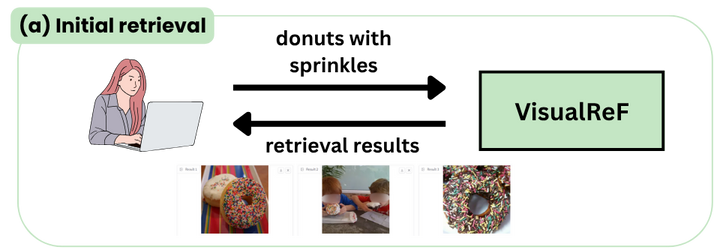
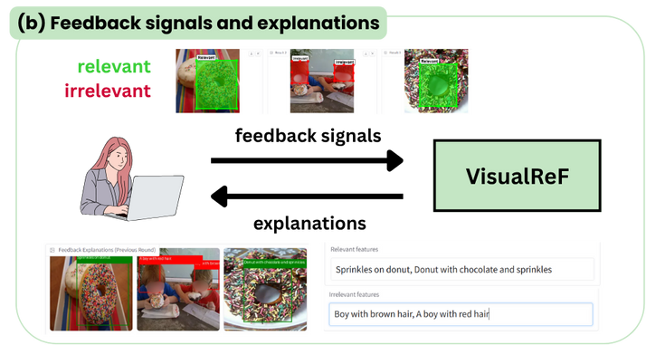
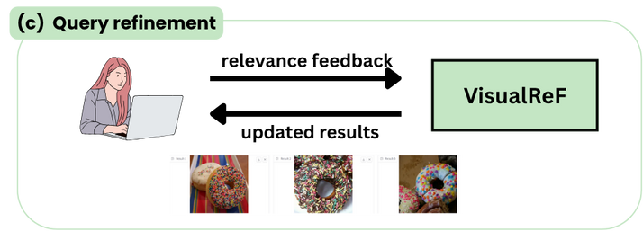

# VisualReF: Visual Relevance Feedback Prototype for Interactive Image Retrieval

This is an official implementation of the demo paper "VisualReF: Visual Relevance Feedback Prototype for Interactive Image Retrieval" presented at Recsys'25.

VisualReFis the prototype of an interactive image search system based on visual relevance feedback.

The system that uses relevance feedback provided by the user to improve the search results. Specifically, the user can annotate the relevance and irrelevance of the retrieved images. These annotations are then used by image captioning model (currently, LLaVA-1.5 7b) to generate captions for image fragments from relevance feedback. These captions are then used to refine the search results using Rocchio's algorithm.

Bibtex:
```
@inproceedings{10.1145/3705328.3759341,
author = {Khaertdinov, Bulat and Popa, Mirela and Tintarev, Nava},
title = {VisualReF: Interactive Image Search Prototype with Visual Relevance Feedback},
year = {2025},
isbn = {9798400713644},
publisher = {Association for Computing Machinery},
address = {New York, NY, USA},
url = {https://doi.org/10.1145/3705328.3759341},
doi = {10.1145/3705328.3759341},
booktitle = {Proceedings of the Nineteenth ACM Conference on Recommender Systems},
pages = {1353–1356},
numpages = {4},
location = {
},
series = {RecSys '25}
}
```

## Example of the use case:
(a) Input query and retrieved images:



(b) User annotates the relevance and irrelevance of the retrieved images and the system returns the explanation of the relevance (captioning results)



(c) User launches the refinement process and gets the updated search results:



Check more examples in the `./assets` folder.

## Configs:
- Captioning model and prompts: `configs/captioning/`. Prompts used to generate captions can be changed based on the use case and level of detail required. Advanced prompting techniques can be used to improve the quality of the captions.
- Demo: `configs/demo/`. Configs for the demo app: retrieval backbone (CLIP and SigLIP are currently supported), image database, and captioning model.

## Getting started

The prototype is implemented using Gradio, PyTorch, and Hugging Face. It supports CPU and GPU, with a GPU (16+ GB VRAM) recommended for faster inference.

Python version: 3.11

We use `venv` for managing project dependencies.

```
python -m venv venv
source venv/bin/activate
pip install -r requirements.txt
```

## Data

We use two open-source datasets as use-cases for our demo:

1. General image search with COCO dataset:

    Data preparation: 
    ```
    mkdir data
    mkdir data/coco

    cd data
    wget http://images.cocodataset.org/zips/train2014.zip
    wget http://images.cocodataset.org/zips/val2014.zip
    wget http://images.cocodataset.org/zips/test2014.zip

    unzip train2014.zip -d coco/
    unzip val2014.zip -d coco/
    unzip test2014.zip -d coco/
    ```

    Build a faiss index with `clip-vit-large-patch14` for the test set:
    ```
    cd ./server
    python -m src.utils.write_faiss_index \
        --data data/coco/test2014 \
        --output faiss/coco/ \
        --batch_size 64 \
        --model_family clip \
        --model_id openai/clip-vit-large-patch14
    ```

    It is also possible to index the whole database (will take longer) with `--data data/coco/`.

2. Retail catalogue search with Retail-786k:
    Data preparation:
    ```
    wget https://zenodo.org/records/7970567/files/retail-786k_256.zip?download=1 -O retail-768k_256.zip

    unzip retail-786k_256.zip -d data/
    ```

    Build faiss index with `clip-vit-large-patch14`:
    ```
    cd ./server
    python -m src.utils.write_faiss_index \
        --data data/retail-786k_256/ \
        --output faiss/retail/test \
        --batch_size 64 \
        --model_family clip \
        --model_id openai/clip-vit-large-patch14
    ```

## Launch the prototype

The prorotype has two versions:
    - **Pure visual feedback.** In this case user feedback is processed directly from the visual modality.
    - **GenAI feedback.** This version use Llava-1.5-7b to caption (ir)relevant image segments to run relev

For each version, we have a separate client (gradio interface) and retrieval server services (overall, 4 services). Each of them is running in separate Docker containers and communicating via an API.

### 1. Quickstart with Docker Compose

The recommended way to run both services is using Docker Compose. This will automatically build and launch both containers with the correct configuration and networking.

#### Prerequisites
- Docker and Docker Compose installed

#### Steps

1. Configure your settings:

   - Define your configuration files or edit the default ones (e.g., `configs/demo/coco_clip_large.yaml` and `configs/captioning/llava_8bit.yaml`).
   - Set up local env file, containing URL of servers. For example, you can create `.env.local` in the root of the repo:
   
   ```
    SERVER_URL=http://retrieval-server:8000
    SERVER_VISUAL_URL=http://retrieval-server-visual:8001
   ```

   Such configuration can be used for running both server and client on the same device.

2. Build and launch services:

   Build the images for both server and client (Gradio UI). 

   **Pure visual feedback**. From the project root directory:
   - Server:
   ```
   sh ./scripts/launch_docker_visual_server.py
   ```
   - Client:
   ```
   sh ./scripts/launch_docker_visual_client.py
   ```

   **GenAI feedback**. From the project root directory:
   - Server:
   ```
   sh ./scripts/launch_docker_llava_server.py
   ```
   - Client:
   ```
   sh ./scripts/launch_docker_llava_client.py
   ```

3. **Access the Gradio client UI**

   Once the containers are up, open your browser and go to:
   ```
   http://localhost:<PORT>
   ```
   By default port 7862 is assigned for an interface. You can check the port in the output of the script launching client container.

**Note:**
- GPU usage in Docker requires the [NVIDIA Container Toolkit](https://docs.nvidia.com/datacenter/cloud-native/container-toolkit/install-guide.html).